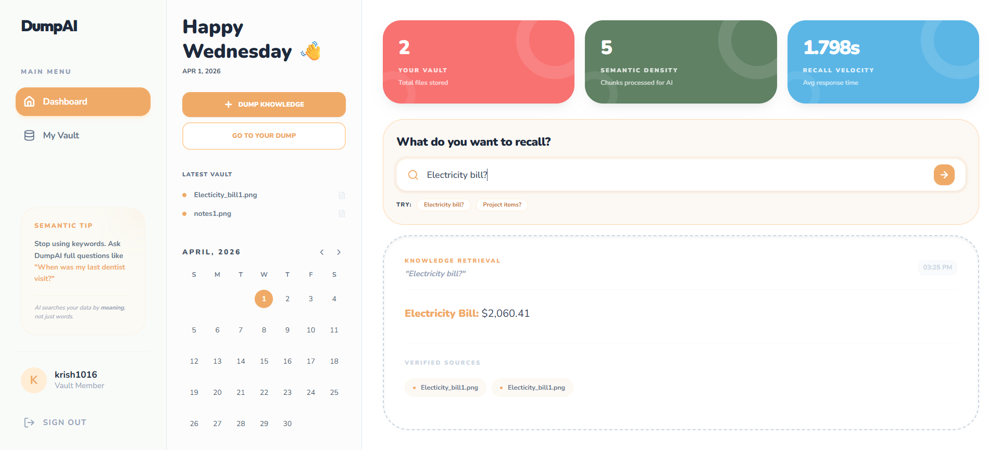

# 🚀 DumpAI — Intelligent Personal Knowledge Vault

> Stop organizing. Start dumping.  
> Transform unstructured data into instantly searchable intelligence using AI.

---

## 💡 The Vision

We consume massive amounts of information daily, but retrieving it later depends on remembering filenames or keywords.

**DumpAI eliminates folder fatigue** by using semantic understanding (vector embeddings) to retrieve knowledge based on meaning — not just text.

---

## ✨ Features at a Glance

- ⚡ **Asynchronous AI Processing** — Non-blocking ingestion using AWS SQS  
- 🧠 **Semantic Search (RAG)** — Query meaning, not keywords  
- 📄 **Multi-Modal Support** — PDFs, Images, Raw Text  
- 🔐 **Secure Multi-Tenant Vaults** — JWT-based authentication  
- 📊 **Real-Time Observability** — Track latency & token usage  
- ☁️ **Cloud-Native Architecture** — AWS + Supabase + Vercel  

---

## ⚙️ Ingestion Pipeline

### 🟢 Producer (API Layer)
- Validates input using Pydantic  
- Stores metadata in PostgreSQL  
- Uploads files to AWS S3  
- Pushes ingestion tasks to AWS SQS  

### 🟡 Consumer (Worker Layer)
- Polls messages from SQS  
- Performs OCR (Tesseract) & PDF parsing  
- Splits text into semantic chunks  
- Generates embeddings using MiniLM  

### 🔵 Retrieval Layer
- Hybrid Search:
  - Cosine Similarity (semantic search)
  - ILIKE filtering (keyword precision)

---

## 🧠 AI & Data Pipeline

- **Llama 3 (via Groq)** — Fast LLM for RAG-based responses  
- **all-MiniLM-L6-v2** — Text embedding model (384-dimension vectors)  
- **Tesseract OCR** — Extracts text from images/screenshots  
- **PyPDF** — Parses documents with smart chunking  

---

## 🧰 Tech Stack

### 🖥️ Frontend
- React.js  
- Tailwind CSS  
- Markdown Rendering  
- Lucide Icons  

### ⚙️ Backend
- FastAPI (Python)  
- SQLAlchemy  
- Pydantic  
- JWT Authentication  
- Bcrypt  

### 🗄️ Databases
- PostgreSQL (Supabase)  
- pgvector (vector search)  
- MongoDB (optional support)  
- Redis  

### ☁️ Cloud & DevOps
- AWS EC2  
- AWS S3  
- AWS SQS  
- AWS Lambda  
- Docker  
- Vercel  

---

